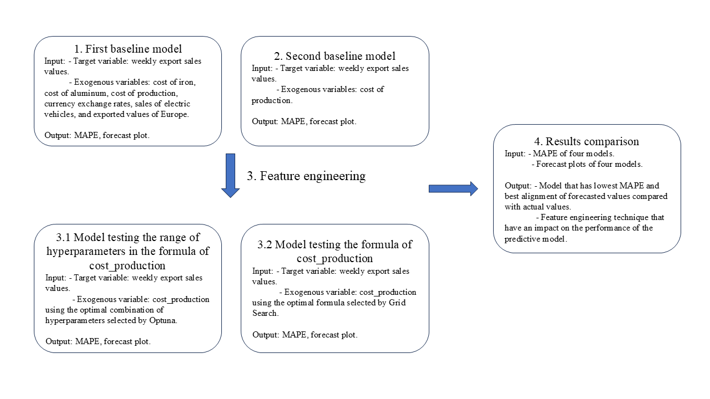

# Feature engineering the formula of the cost of production
An analysis of the case study in the automotive parts manufacturing industry to enhance the performance of the sales forecasting models.

## Project description
This study will examine the effects of feature engineering targeting an external factor on the sales forecasting model using AutoRegressive Integrated Moving Average with Exogenous Variables (ARIMAX) in the automotive parts manufacturing industry. The selected feature engineering strategies to transform the formula of an exogenous variable - the cost of production, are testing the hyperparameter range and the formula of the cost of production. The effect of these feature engineering techniques will be evaluated based on their influence on the accuracy of the predictive models that consider historical data from an EU-based automotive parts manufacturer exporting to the US as a target variable, and external market data including currency exchange rate, sales of electric vehicles and cost of materials required in the production of an engine as exogenous variables

## Research question
To what extent does feature engineering regarding the formula of production costs influence the performance of sales forecasting models in the automotive parts manufacturing industry?

## Approach


## Metrics
* Mean Absolute Pecentage Error (MAPE)
* Forecast plots observation

## Results
* A detailed results, which were illustrated by graphs, can be found in the .ipynb file.
* Main findings:
  1.  Different feature engineering techniques regarding the cost of production formula do not have a significant impact on the performance of the sales predictive model.
  2.  However, feature engineering is still a good approach to improve the accuracy rate of the predictive model.

## Packages installation
To run this project:
```python
!pip install pmdarima optuna statsmodels
import pandas as pd
import numpy as np
import matplotlib.pyplot as plt
import seaborn as sns
from statsmodels.tsa.arima.model import ARIMA
from statsmodels.tsa.stattools import adfuller
from pmdarima import auto_arima
import optuna
```
